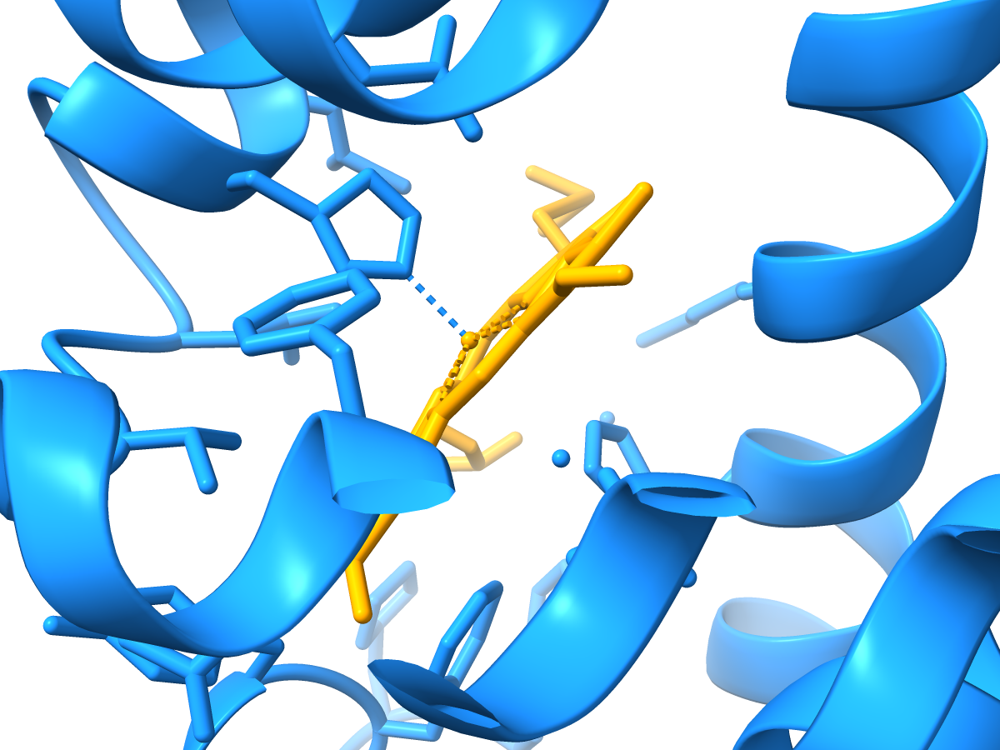
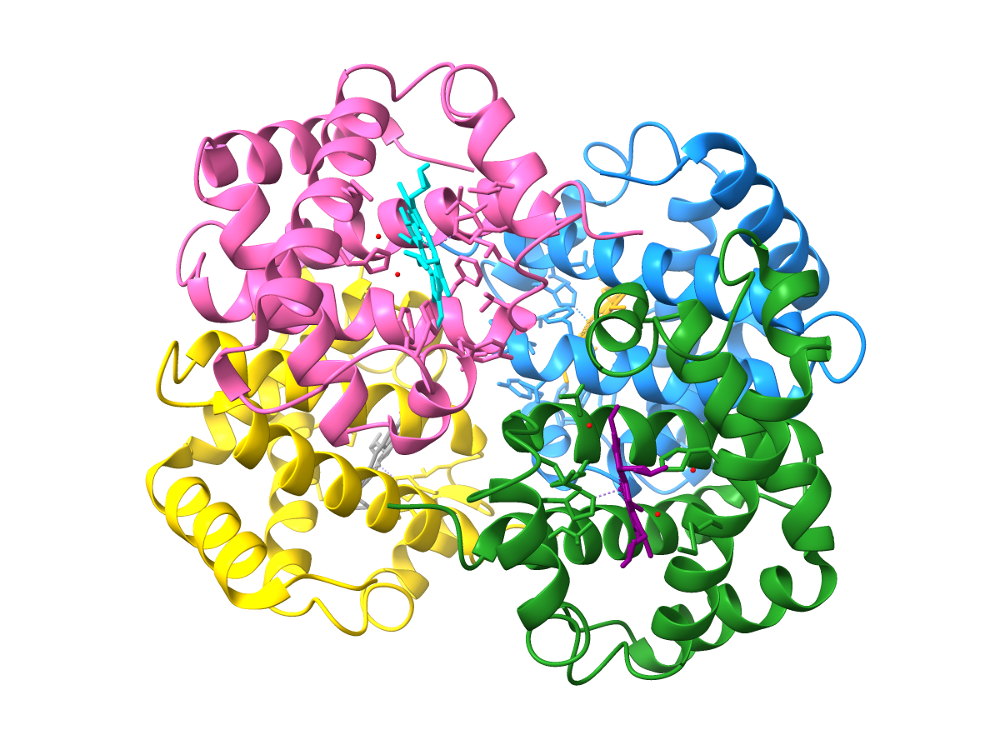

# ChimeraX-LabelAsym

ChimeraX bundle that exposes the mmCIF `label_asym_id` as a residue attribute,
so you can select residues by the PDBx-canonical chain ID in addition to the
author-assigned chain ID (`auth_asym_id`) that ChimeraX uses by default.

## Why

In mmCIF:

- `auth_asym_id` — author-assigned chain (what `/A` in ChimeraX selects).
- `label_asym_id` — PDB-canonical chain.

They can differ. For example, in `4hhb` the four heme groups all share an
`auth_asym_id` with their host protein chain, but each has its own
`label_asym_id`:

| entity           | `auth_asym_id` | `label_asym_id` |
|------------------|:--------------:|:---------------:|
| α1 protein       | A              | A               |
| β1 protein       | B              | B               |
| α2 protein       | C              | C               |
| β2 protein       | D              | D               |
| heme of α1       | A              | E               |
| heme of β1       | B              | F               |
| heme of α2       | C              | G               |
| heme of β2       | D              | H               |

Without `label_asym_id` there is no way to pick exactly one heme through the
default `/A` syntax — it always carries the protein with it.

## Usage

After installing the bundle, any structure opened from mmCIF metadata gets a
`label_asym_id` attribute on every residue automatically:

```
open 4hhb format mmcif
# log: [label-asym] 4hhb: assigned label_asym_id to 801/801 residues

color ::label_asym_id="A" dodger blue    # just the α1 protein
color ::label_asym_id="E" orange         # just its heme
view  ::label_asym_id="E"                # zoom to that heme
```

<p align="center">
  
</p>

The built-in `/A` syntax continues to work as before (author chain).

### Every entity in its own colour

```
color ::label_asym_id="A" dodger blue
color ::label_asym_id="B" forest green
color ::label_asym_id="C" hot pink
color ::label_asym_id="D" gold
color ::label_asym_id="E" orange
color ::label_asym_id="F" red
color ::label_asym_id="G" purple
color ::label_asym_id="H" cyan
```

<p align="center">
  
</p>

Note: quotes around single-letter values are required (e.g. `="A"`). Without
the quotes, ChimeraX's atom-spec parser reads single letters such as `A`,
`C`, or `G` as residue-code tokens and rejects the selection.

## Build & Install

```bash
echi build
echi install
```

## Test

Unit tests (pure Python, no ChimeraX runtime required):

```bash
uv run --with pytest --no-project pytest
```

Integration smoke test (requires ChimeraX):

```bash
echi run --script scripts/smoke.cxc
```

## How it works

1. `custom-init = true` in `pyproject.toml` runs `initialize()` on ChimeraX
   startup.
2. `hook.install()` registers `Residue.label_asym_id` as a persistent string
   attribute and hooks the `ADD_MODELS` trigger.
3. On every new `AtomicStructure`, the hook pulls the `atom_site` CIF table
   (via `get_mmcif_tables_from_metadata`, falling back to re-reading the file
   with `get_cif_tables`) and builds a
   `(auth_asym_id, auth_seq_id, ins_code) → label_asym_id` map.
4. Each residue gets its `label_asym_id` attribute set. Non-mmCIF structures
   are silently skipped.

## Limitations

- Only mmCIF-derived structures are annotated. PDB-format input does not carry
  `label_asym_id`.
- Currently no short syntax such as `/A'` — that would require extending
  ChimeraX's atom-spec parser.

## License

MIT
